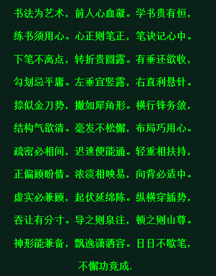

# 书法入门歌

- 书法为艺术，前人心血凝。
- 学书贵有恒，练书须用心。
- 心正则笔正，笔决记心中。
- 下笔不离点，转折贵圆露。
- 有垂还欲收，勾划忌平庸。
- 左垂宜竖露，右直利悬针。
- 捺似金刀势，撇如犀角形。
- 横行锋务敛，结构气欲清。
- 毫发不松懈，布局巧用心。
- 疏密必相间，迟速便能通。
- 轻重相扶持，正偏顾盼情。
- 浓淡相映易，向背必适中。
- 虚实必兼顾，起伏延绵陈。
- 纵横穿插势，吞让有分寸。
- 导之则泉注，顿之则山尊。
- 神形能兼备，飘逸潇洒容。
- 日日不歇笔，不懈功竟成。

楷书口诀
楷书称正楷 起笔多藏锋
学书必先行 行笔用中锋
笔画形态稳 回锋要自然
字字得端正 结构讲造型
结构搭配匀 多临古人帖
章法要讲究 用笔讲技巧
笔笔得到位 楷书要写好
清朗必整齐 重在用腕上

行书口诀
行楷书写要流畅 主笔沉着是关键
快写简化是特征 连笔轻细不可粗
伸缩性大变体多 用笔最好是长锋
执笔用笔如草书 使墨必须调湿润
执笔必须悬起肘 全篇排头是标准
灵活多变才自如 一气呵成要贯通

隶书口诀
方劲古拙 如龟如鳖
蚕头雁尾 笔必三折
雁不双飞 蚕无二色
点画俯仰 左挑右磔
重浊轻清 斩钉截铁

魏碑口诀
魄力雄强 精神飞动
气象浑穆 兴趣酣足
笔法跳跃 骨血润达
点画峻厚 结构天成
意态飘逸 血肉丰美

草书要决
草书行行如春蚓 字字造型似秋蛇
全章一起要贯通 有气有神是精品

狂草要决
狂草如激电湍流 字字如惊蛇出洞
点线变化多姿美 疏密虚实心有数
气势磅礴态万千 结构布白心畅意