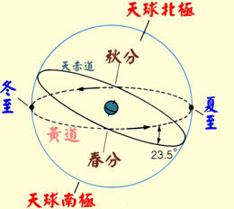

# 公历-农历-阴历-阳历

## 何为“历”

在《说文解字》中，写道“历,过也”。由此可知，“历”的本意是“经过”（例如，经历、阅历）；而“历法”则引申为“推算时间（年、月、日和节气）的方法”。

## 农历

很多人不了解`农历`，常常把`农历`和`阴历`混淆。

中国的`农历`是`阴阳历`。`阳历`就是`农历`里的`太阳历`，`阴历`就是`农历`里的`月亮历`。

`阳历`主要是`二十四节气`，二十四节气是按照地球在黄道上位置划分的。黄道可以理解成地球围着太阳公转的轨道，一共360°，每15°为一个节气。

`春分`和`秋分`就是白天黑夜刚好等长的日子。

`阴历`是按月亮的月相来安排的。

“月”是“朔望月”的简称。月亮轨道上绕行到太阳和地球之间，月亮的黑暗半球对着地球，这时叫朔，正是阴历每月的初一。

> 朔，表示“初,始”，指“农历每月初一”。皆从其朔。——《礼记·礼运》，其中“朔”表示“始”，整句表示“都从那儿开始”。

当月亮绕行至地球的后面，被太阳照亮的半球对着地球，这时叫望，一般在阴历每月十五或六十日。

> 望,远视也。——《玉篇》  
> 望,出亡在外望其还也。——《说文》  
> 望,接近。望秋先陨，汉语成语，拼音是wàng qiū xiān yǔn，意思是指草木将近秋天即败落凋零。宋·沈括《梦溪笔谈·采草药》：“岭峤微草，凌冬不凋；并、汾乔木，望秋先陨；诸越则桃李冬实，朔漠则桃李夏荣。”

一年的时间为365.25日，月球围着地球转一圈的时间是29.53日。

而每年的太阳历一年和月亮历十二月并不是完全对等，为了弥补二者的差，农历从春秋时代就基本采用十九年七闰的方法，也就是每十九年里额外补充七个闰月来填补：

365.25*19=6939.75=29.53*(19*12+7)

阴历每月的天数根据月相而定，30日的称为大月，29日的称为小月（阴历月份并没有31天）。

阴历十二个月称为：子月、丑月、寅月、卯月、辰月、巳月、午月、未月、申月、酉月、戌月、亥月。

阴阳历中定冬至所在的月为子月，大寒所在的月为丑月，雨水所在的月为寅月。这点在补充闰月以后，确定了阴历阳历的对应关系。

秦始皇统一的“颛顼历”以亥月为正月，也就是农历十月为正月。到了西汉，汉武帝把正月往后推了三个月，也就是以寅月为正月，沿用至今。
