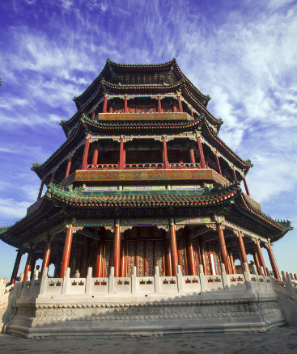
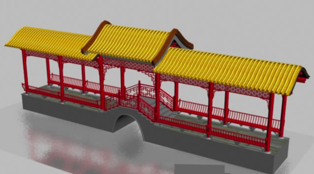

# 居

居是住所，住宅的统称。例如，故居。

- 轩（xuān）
  - 指古代一种有围棚或帷幕的车
  - 或者是有窗的长廊或小屋。
- 阁：
  - 类似楼房的建筑物，供远眺、游憩、藏书和供佛之用。例如，楼阁、滕王阁。
  - 特指女子的卧房。
- 楼：房间上部空间附设的可供藏物或住人的分层结构。表示楼房，楼宇，大楼等。
- 斋：书斋，东斋；斋屋（读书、休息、思过、斋戒的房舍）
- 堂：正房，高大的房子。例如，堂屋、礼堂。

归类

- 轩、阁、斋、堂多用于小的居所。女子居住的建筑物多是用较婉约的轩、阁来命名。
- 楼，相对来说多为大型的、分层的建筑物。

## 私人住宅

- 宅。居住地方。（一般富有的大家族）
- 府，旧指大官、贵族的住宅。例如，贾府。
- 邸，高级官员的住所，如：官邸。

## 闹市建筑（人群多、且公共场合）

### 楼

楼，是两重以上的屋，故有“重层曰楼”之说。

楼的位置在明代大多位于厅堂之后，在园林中一般用作卧室、书房或用来观赏风景。由于楼高，也常常成为园中的一景，尤其在临水背山的情况下更是如此。

### 阁

阁（gé），与楼近似，但较小巧。平面为方形或多边形，多为两层的建筑，四面开窗。一般用来藏书、观景，也用来供奉巨型佛像。

## 私人住宅的一部分

- 廊：屋檐之下的过道，如：九曲回廊。
- 轩：有窗的长廊或小室，如：惜抱轩。
- 斋：一般是书房，或者读书的地方。

### 堂

堂（táng）：是居住建筑中对正房的称呼，一般是一家之长的居住地，也可作为家庭举行庆典的场所。

堂多位于建筑群中的中轴线上，体型严整，装修瑰丽。室内常用隔扇、落地罩、博古架进行空间分割。

### 厢

厢，正房两侧房屋。例如，西厢房。

### 斋

斋（zhāi）：一般是书房，或者读书的地方。斋，含有静心、自省思过的成份。

### 祠

祠：比庙规模小一些的建筑，如：宗祠。

## 园林

- 亭：有顶无墙的小型建筑，如：醉翁亭。
- 榭：建筑在台上的房屋，如：水榭。

## 亭

亭，体积小巧，造型别致，可建于**园林**的任何地方，其主要用途是供人休息、避雨。亭子的结构简单，其柱间通透开辟，柱身下设半墙。从亭的平面来看，可分为正多边形亭、长方形和近长方形亭、圆亭和近圆亭、组合式亭等等，从立体构形来说，又可分为单檐、重檐和三重檐等类型。

## 轩

轩，本来是指有窗槛的小室或长廊，但也可用作书房的雅号。

轩是中国古代建筑中特有的造型，一面全开敞，没有墙壁门窗。在**园林**风景中常用，用于观景。在古代讲学时，因为来的人太多，为了容纳更多的人而在轩处讲学。

榭
水边建筑，人们在此倚栏赏景。凭藉景而设，除了水边，有的也设于花间。榭不但多设与水边，而且多设于水之南岸，视线向北而观景。建筑在南，水面在北，所见之景是向阳的；若反之，则水面反射阳光，很刺眼，而且对面之景是背阳的，也不好看。另外，榭在临水处多设栏，坐凳栏杆，又叫美人靠、吴王靠，相传是吴越时吴王与美人西施游赏观景之物，这也是文化了。后来这种美人靠栏杆多经诗词描述，更增其文化内涵。

## 防御建筑

- 城：都邑四周防御的城垣，如长城。
- 堡（bǎo）：围有土墙的城镇或乡村，如吴堡，读“补”音。

堡

- pù 用于地名。有的地区把“铺”写作堡，如十里堡。
- bǎo 土筑的小城。也泛指军事上构筑的工事

## 皇家建筑

### 宫殿

宫殿，是居住的处所，古时候私人居住的地方叫“宫”；接待大众，办公集会的场所称为“殿”。

殿，高大的房屋，特指供奉神佛或帝王受朝理政的房屋。例如，大雄宝殿、太和殿。

- 陵：帝王的墓地，如：明十三陵。
- 坛：古代举行祭祀、誓师等大典用的台，如：天坛。

## 出家人的建筑（注重清静）

### 佛家建筑

- 塔：用来藏舍利和经卷的建筑，以方形、八角形为多，如：大雁塔。
- 刹：佛塔和佛寺的统称，即佛教的寺庙，如：古刹。
- 寺：僧众供佛的处所，如：少林寺。
- 庙：奉祀祖宗、神佛或前代贤哲的处所，如家庙、土地庙、孔庙。

### 女性出家人的建筑

- 庵：尼姑住的佛寺，如：尼姑庵。

### 道家建筑

- 观：道教的庙宇，如：白云观。
