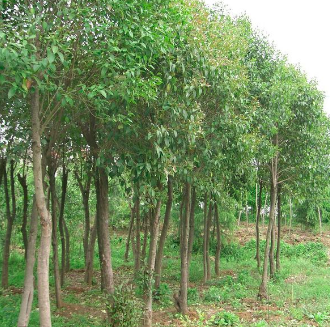
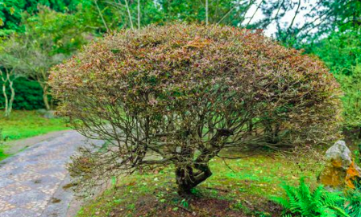

# 乔木与灌木

乔木与灌木

- （1）高度的区别。乔木通常可以长到树同6米以上，而灌木树高在3米左右不超过6米。
- （2）主干的区别。
  - 乔木有明显主干，长到一定高度时会开始分枝，一般常见的树木皆属于乔木，例如杨树、木棉花、榕树、樟树等。
  - 灌木则是没有明显主干，从地面开始就会长出很多枝干，一般来说植株会比乔木矮小很多，像茶花、杜鹃、玫瑰、栀子花等。
- （3）不管是乔木或灌木又依落叶的情形分成常绿乔木、落叶乔木、常绿灌木、落叶灌木。常绿乔木、灌木全年都会保持叶片繁盛的状态，即使叶片老化掉落，也会很快长出新叶;落叶乔木、灌木则是一年当中有一段时间叶子会完全掉落，呈现光秃秃的样子。

