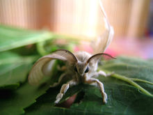

# 怨情

- 朝代：唐代
- 作者：李白

美人卷珠帘，深坐颦蛾眉。  
但见泪痕湿，不知心恨谁。

原文：

美人卷珠簾，深坐顰蛾眉。(顰蛾眉 一作：蹙)
但見淚痕溼，不知心恨誰。

譯文
美人兒捲起珠簾一直等待，一直坐着把雙眉緊緊鎖閉。
只看見她淚痕溼滿了兩腮，不知道她是恨人還是恨己。

註釋
①“深坐”句：寫失望時的表情。深坐，久久呆坐。蹙蛾眉：皺眉。

英譯

Beauty rolled bead curtain waiting, always sat with her brows tightly locking.
Just to see her tears wet two full cheeks, does not know she is love or hate yourself.

蛾眉（é méi）： 蚕蛾触须**细长**而**弯曲**。因此，用来比喻女子美丽的眉毛，非常受古代女子喜爱。

颦（pín）：表示皱眉，如一颦一笑、东施效颦。颦是上下结构，部首为页，总笔画数为21，可作动词、形容词。

