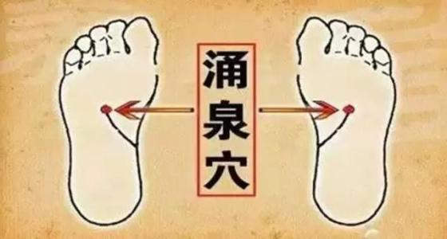
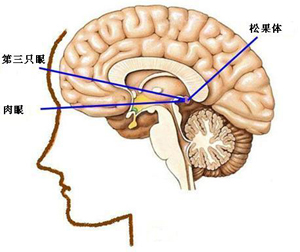
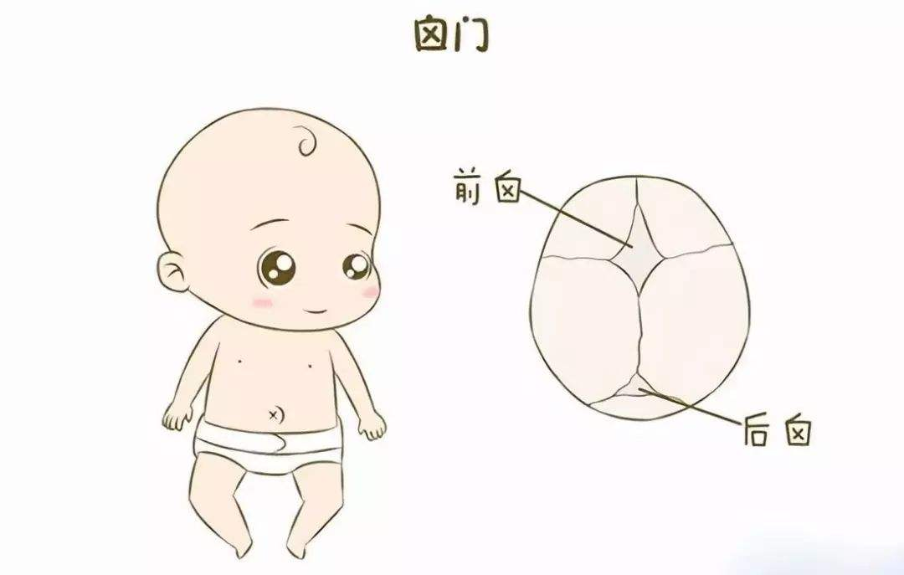
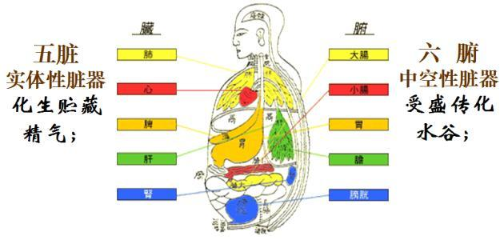
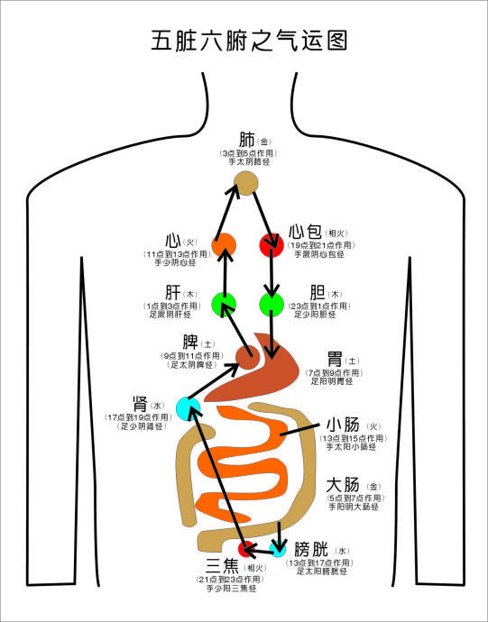

# 第二回·悟彻菩提真妙理 断魔归本合元神

話表美猴王得了姓名，怡然踴躍，對菩提前作禮啟謝。那祖師即命大眾引孫悟空出二門外，教他灑掃應對、進退周旋之節。眾仙奉行而出。悟空到門外，又拜了大眾師兄，就於廊廡之間安排寢處。次早，與眾師兄學言語禮貌、講經論道、習字焚香。每日如此。閑時即掃地鋤園、養花修樹、尋柴燃火、挑水運漿。凡所用之物，無一不備。在洞中不覺倏六七年。

> 窃以为：“那祖师即命大众引孙悟空出二门外，教他洒扫应对，进退周旋之节”。原来悟空，也并非一来就开始学“道法”，而是先学“洒扫应对”和“周旋之节”。如此一来，便是六七年的光景。

一日，祖師登壇高坐，喚集諸仙，開講大道。真個是：

天花亂墜，地湧金蓮。妙演三乘教，精微萬法全。慢搖麈尾噴珠玉，響振雷霆動九天。說一會道，講一會禪，三家配合本如然。開明一字皈誠理，指引無生了性玄。

孫悟空在傍聞講，喜得他抓耳撓腮，眉花眼笑，忍不住手之舞之，足之蹈之。忽被祖師看見，叫孫悟空道：「你在班中，怎麼顛狂躍舞，不聽我講？」悟空道：「弟子誠心聽講，聽到老師父妙音處，喜不自勝，故不覺作此踴躍之狀。望師父恕罪。」祖師道：「你既識妙音，我且問你，你到洞中多少時了？」悟空道：「弟子本來懵懂，不知多少時節。只記得灶下無火，常去山後打柴，見一山好桃樹，我在那裡吃了七次飽桃矣。」祖師道：「那山喚名爛桃山。你既吃七次，想是七年了。你今要從我學些甚麼道？」悟空道：「但憑尊師教誨，只是有些道氣兒，弟子便就學了。」

> 窃以为：“喜得他抓耳挠腮，眉花眼笑，忍不住手之舞之，足之蹈之”。可见，这悟空真是“喜不自胜”。  
> 悟空来到这里，至此时，已经七年过去了。

祖師道：「『道』字門中有三百六十傍門，傍門皆有正果。不知你學那一門哩？」悟空道：「憑尊師意思，弟子傾心聽從。」祖師道：「我教你個『術』字門中之道，如何？」悟空道：「術門之道怎麼說？」祖師道：「術字門中，乃是些請仙、扶鸞、問卜、揲蓍，能知趨吉避凶之理。」悟空道：「**似這般可得長生麼**？」祖師道：「不能，不能。」悟空道：「不學，不學。」

> 这个是“术”字门。  
> “似这般可得长生么”

祖師又道：「教你『流』字門中之道，如何？」悟空又問：「流字門中是甚義理？」祖師道：「流字門中，乃是儒家、釋家、道家、陰陽家、墨家、醫家，或看經，或念佛，並朝真降聖之類。」悟空道：「**似這般可得長生麼**？」祖師道：「若要長生，也似壁裡安柱。」悟空道：「師父，我是個老實人，不曉得打市語。怎麼謂之『壁裡安柱』？」祖師道：「人家蓋房，欲圖堅固，將牆壁之間立一頂柱，有日大廈將頹，他必朽矣。」悟空道：「據此說，也不長久。不學，不學。」

> 这个是“流”字门。  
> 朽,腐也。——《说文》  
> “人家盖房欲图坚固，将墙壁之间立一顶柱，有日大厦将颓，他必朽矣”。我觉得这个“顶柱”的材料，应该是木头，所以才会“朽”。另外，我觉得，是因为顶柱“朽”才导致大厦将颓，而不是“大厦将颓”导致顶柱“朽”。

祖師道：「教你『靜』字門中之道，如何？」悟空道：「靜字門中是甚正果？」祖師道：「此是休糧守谷、清靜無為、參禪打坐、戒語持齋，或睡功，或立功，並入定、坐關之類。」悟空道：「**這般也能長生麼**？」祖師道：「也似窰頭土坯。」悟空笑道：「師父果有些滴澾。一行說我不會打市語。怎麼謂之『窰頭土坯』？」祖師道：「就如那窰頭上造成磚瓦之坯，雖已成形，尚未經水火鍛煉，一朝大雨滂沱，他必濫矣。」悟空道：「也不長遠。不學，不學。」

> 这个是“静”字门。  
> 滴澾。澾（tà），是湿润的样子。  
> “土坯”的材质是“土”，不是“木”，因此不存在自己“朽”的问题。这“木朽”的原因是来自于材质，来自于“木”，来源于自身。“土坯”虽不“自朽”，但是受大雨滂沱（外在因素的影响），却会滥掉。

祖師道：「教你『動』字門中之道，如何？」悟空道：「動門之道卻又怎麼？」祖師道：「此是有為有作：採陰補陽、攀弓踏弩、摩臍過氣、用方炮製、燒茅打鼎、進紅鉛、煉秋石，並服婦乳之類。」悟空道：「**似這等也得長生麼**？」祖師道：「此欲長生，亦如水中撈月。」悟空道：「師父又來了。怎麼叫做『水中撈月』？」祖師道：「月在長空，水中有影，雖然看見，只是無撈摸處，到底只成空耳。」悟空道：「也不學，不學。」

> 这个是“动”字门。  

祖師聞言，咄的一聲，跳下高臺，手持戒尺，指定悟空道：「你這猢猻，這般不學，那般不學，卻待怎麼？」走上前，將悟空頭上打了三下。倒背著手，走入裡面，將中門關了，撇下大眾而去。諕得那一班聽講的人人驚懼，皆怨悟空道：「你這潑猴，十分無狀。師父傳你道法，如何不學，卻與師父頂嘴？這番衝撞了他，不知幾時才出來啊！」此時俱甚報怨他，又鄙賤嫌惡他。悟空一些兒也不惱，只是滿臉陪笑。原來那猴王已打破**盤中之謎**，暗暗在心，所以不與眾人爭競，只是忍耐無言。祖師打他三下者，教他三更時分存心；倒背著手走入裡面，將中門關上者，教他從後門進步，秘處傳他道也。

> 諕（xià），古同“吓”，使害怕。  
> “此時俱甚報怨他，又鄙賤嫌惡他”。其中，“報怨”大概是因为“气”走了祖师，“鄙賤嫌惡”大概是因为“师傅要传你道法，你却还挑三拣四的”。  
> “悟空一些兒也不惱，只是滿臉陪笑”。悟空，此时的心境真是不同，他心中明确知道自己想要的是什么，即使别人“鄙賤嫌惡”他，他也不“惱”。这让我想到一句话，“如果你知道自己想要什么，那么你就能承受所遭遇的一切苦难”。

當日悟空與眾等喜喜歡歡，在三星仙洞之前，盼望天色，急不能到晚。及黃昏時，卻與眾就寢，假合眼，定息存神。山中又沒打更傳箭，不知時分，只自家將鼻孔中出入之氣調定。約到子時前後，輕輕的起來，穿了衣服，偷開前門，躲離大眾，走出外，擡頭觀看，正是那：

- 月明清露冷，八極迥無塵。
- 深樹幽禽宿，源頭水溜汾。
- 飛螢光散影，過雁字排雲。
- 正直三更候，應該訪道真。

> 八极，八方极远之地。八方，指东、西、南、北、东南、西南、西北、东北八个方向。  
> 幽，我觉得是形容词，表示“形容地方很僻静又光线暗”。  
> &nbsp;  
> 溜汾，两个字应该都是描述“源头水”的，但“溜汾”也不是固定词组，不好解释。  
> 溜（liù），古水名，又名“潭水”。溜水出郁林郡。——《说文》  
> 汾河，古称“汾”，又称汾水，黄河的第二大支流，汾者，大也，汾河因此而得名。  
> 难道是说“汾河、溜水都是属于源头水”的意思？  

你看他從舊路徑至後門外，只見那門兒半開半掩。悟空喜道：「老師父果然注意與我傳道，故此開著門也。」即曳步近前，側身進得門裡，只走到祖師寢榻之下。見祖師踡跼身軀，朝裡睡著了。悟空不敢驚動，即跪在榻前。那祖師不多時覺來，舒開兩足，口中自吟道：

> “即曳步近前，側身進得門裡”。其中，“側身”的目的是为了不闹出声响，也体现出一些“不惊动师父、尊重师父”的意思。  
> 踡（quán），屈曲;弯曲。  
> 跼（jú），腰背弯曲,曲屈。

「難！難！難！道最玄，莫把金丹作等閑。不遇至人傳妙訣，空言口困舌頭乾！」

> “不遇至人傳妙訣”。想必“悟空”就是那“至人”。

悟空應聲叫道：「師父，弟子在此跪候多時。」祖師聞得聲音是悟空，即起披衣，盤坐喝道：「這猢猻，你不在前邊去睡，卻來我這後邊作甚？」悟空道：「師父昨日壇前對眾相允，教弟子三更時候，從後門裡傳我道理，故此大膽徑拜老爺榻下。」祖師聽說，十分歡喜，暗自尋思道：「這廝果然是個天地生成的，不然，何就打破我**盤中之暗謎**也？」悟空道：「此間更無**六耳**，止只弟子一人，望師父大捨慈悲，傳與我長生之道罷，永不忘恩。」祖師道：「你今有緣，我亦喜說。既識得**盤中暗謎**，你近前來，仔細聽之，當傳與你**長生之妙道**也。」悟空叩頭謝了，洗耳用心，跪於榻下。祖師云：

- 顯密圓通真妙訣，惜修性命無他說。
- 都來總是精氣神，謹固牢藏休漏泄。
- 休漏泄，體中藏，汝受吾傳道自昌。
- 口訣記來多有益，屏除邪慾得清涼。
- 得清涼，光皎潔，好向丹臺賞明月。
- 月藏玉兔日藏烏，自有龜蛇相盤結。
- 相盤結，性命堅，卻能火裡種金蓮。
- 攢簇五行顛倒用，功完隨作佛和仙。

> 顯（xiǎn），简体为“显”。  
> 龜（guī ），简体为“龟”。

此時說破根源，悟空心靈福至，切切記了口訣。對祖師拜謝深恩，即出後門觀看。但見**東方**天色微舒白，**西路**金光大顯明。依舊路，轉到前門，輕輕的推開進去，坐在原寢之處，故將床鋪搖響道：「天光了，天光了，起耶！」那大眾還正睡哩，不知悟空已得了好事。當日起來打混，暗暗維持，子前午後，自己調息。

> “子前午後”。其中，“子”是指“子时”，23时至01时。“午”是指“午时”，上午11时至下午1时。

卻早過了三年，祖師復登寶座，與眾說法。談的是**公案比語**，論的是**外像包皮**。忽問：「悟空何在？」悟空近前跪下：「弟子有。」祖師道：「你這一向修些甚麼道來？」悟空道：「弟子近來**法性**頗通，**根源**亦漸堅固矣。」祖師道：「你既通**法性**，會得**根源**，已注**神體**，卻只是防備著**三災**利害。」悟空聽說，沉吟良久道：「師父之言謬矣。我常聞道高德隆，與天同壽；水火既濟，百病不生。卻怎麼有個『三災利害』？」祖師道：「此乃非常之道：奪天地之造化，侵日月之玄機；丹成之後，鬼神難容。雖駐顏益壽，但到了五百年後，天降**雷災**打你，須要見性明心，預先躲避。躲得過，壽與天齊；躲不過，就此絕命。再五百年後，天降**火災**燒你。這火不是天火，亦不是凡火，喚做『陰火』。自本身**湧泉穴**下燒起，直透**泥垣宮**，五臟成灰，四肢皆朽，把千年苦行，俱為虛幻。再五百年，又降**風災**吹你。這風不是東南西北風，不是和薰金朔風，亦不是花柳松竹風，喚做『贔風』。自顖門中吹入**六腑**，過丹田，穿**九竅**，骨肉消疏，其身自解。所以都要躲過。」

> 公案,佛教禅宗术语。原指官府判决的案例。禅宗借用,指前辈大师的言行范例,用来判断是非迷悟; 比语,比方。  
> 外像，佛教语。指显露、表现在外表上的善恶美丑和言语行动。  
> 法性->根源->神体->三灾：雷灾、火灾、风灾  
> &nbsp;  
> 水火既濟。“既济”出自《易经》，是《易经》中的第63卦。“既济卦”，上坎下离相济。其中，“坎”为水，“离”为火，“既济”则是水火相交为用。中医学中所说的“水火既济”，是借用五行学说中相生相克的关系，来比喻“心火”与“肾水”的相互关系。“心火”下行以温养“肾水”，“肾水”上行以灭“心火”，心肾相交，阴阳和谐，身体健康，就称作“水火既济”。
> &nbsp;  
> 涌泉。涌，外涌而出也。泉，泉水也。该穴名意指体内肾经的经水由此外涌而出体表。本穴为肾经经脉的第一穴，它联通肾经的体内体表经脉，肾经体内经脉中的高温高压的水液由此外涌而出体表，故名。

> 泥垣宫，是一个汉语词语，拼音是ní yuán gōng，意思是泥丸宫。  
> 关于泥丸的解释，道家说得很清楚，脑色黄，象于土，故曰“泥丸是土”。所以“泥的丸”并非毫无意义，而是符合道家命名原则的一种形象表达方式。

> 薰金朔風。朔風（shuò fēng），是指北风。“薰金”不知道是什么意思。  
> 贔（bì），中文没有合适的解释意思，英文解释为“strong”。  
> 顖（xìn），同“囟”。  
> 囟门（xìn mén），指婴幼儿颅骨结合不紧所形成的颅骨间隙。有前囟和后囟之分。后囟门靠近头枕部，是两侧顶骨与枕骨之间的骨缝形成的三角形间隙；前囟门在头顶部，是两侧额骨与两侧顶骨之间的骨缝形成的菱形间隙。

> 六腑。五脏六腑。五脏：肝、心、脾、肺、肾；六腑：胃、大肠、小肠、三焦、膀胱、胆。人体内脏器官的统称。也比喻事物的内部情况。

> “九窍”，即指人体的两眼、两耳、两鼻孔、口、前阴尿道和后阴肛门

悟空聞說，毛骨悚然，叩頭禮拜道：「萬望老爺垂憫，傳與躲避三災之法，到底**不敢忘恩**。」祖師道：「此亦無難，只是你比他人不同，故傳不得。」悟空道：「我也頭**圓頂天，足方履地**，一般有九竅四肢，五臟六腑，何以比人不同？」祖師道：「你雖然像人，卻比人少腮。」原來那猴子孤拐面，凹臉尖嘴。悟空伸手一摸，笑道：「師父沒成算。我雖少腮，卻比人多這個素袋，亦可准折過也。」祖師說：「也罷，你要學那一般？有一般天罡數，該三十六般變化；有一般地煞數，該七十二般變化。」悟空道：「弟子願多裡撈摸，學一個地煞變化罷。」祖師道：「既如此，上前來，傳與你口訣。」遂附耳低言，不知說了些甚麼妙法。這猴王也是他一竅通時百竅通，當時習了口訣，自修自煉，將七十二般變化都學成了。

> 履（lǚ）：践踩。

忽一日，祖師與眾門人在三星洞前戲玩晚景。祖師道：「悟空，事成了未曾？」悟空道：「多蒙師父海恩，弟子功果完備，已能霞舉飛昇也。」祖師道：「你試飛舉我看。」悟空弄本事，將身一聳，打了個連扯跟頭，跳離地有五六丈，踏雲霞去勾有頓飯之時，返復不上三里遠近，落在面前，扠手道：「師父，這就是飛舉騰雲了。」祖師笑道：「這個算不得騰雲，只算得爬雲而已。自古道：『神仙朝遊北海暮蒼梧。』似你這半日，去不上三里，即爬雲也還算不得哩。」悟空道：「怎麼為『朝遊北海暮蒼梧』？」祖師道：「凡騰雲之輩，早辰起自北海，遊過東海、西海、南海，復轉蒼梧。蒼梧者，卻是北海零陵之語話也。將四海之外，一日都遊遍，方算得騰雲。」悟空道：「這個卻難，卻難。」祖師道：「世上無難事，只怕有心人。」悟空聞得此言，叩頭禮拜，啟道：「師父，為人須為徹，索性捨個大慈悲，將此騰雲之法，一發傳與我罷，決**不敢忘恩**。」祖師道：「凡諸仙騰雲，皆跌足而起，你卻不是這般。我才見你去，連扯方才跳上。我今只就你這個勢，傳你個觔斗雲罷。」悟空又禮拜懇求，祖師卻又傳個口訣道：「這朵雲，捻著訣，念動真言，攢緊了拳，將身一抖，跳將起來，一觔斗就有十萬八千里路哩。」大眾聽說，一個個嘻嘻笑道：「悟空造化，若會這個法兒，與人家當鋪兵、送文書、遞報單，不管那裡都尋了飯吃。」師徒們天昏各歸洞府。

> 聳（sǒng），简体为“耸”。

這一夜，悟空即運神煉法，會了觔斗雲。逐日家無拘無束，自在逍遙，此亦長生之美。

一日，春歸夏至，大眾都在松樹下會講多時。大眾道：「悟空，你是那世修來的緣法？前日老師父附耳低言，傳與你的躲三災變化之法，可都會麼？」悟空笑道：「不瞞諸兄長說，一則是師父傳授，二來也是我晝夜慇懃，那幾般兒都會了。」大眾道：「趁此良時，你試演演，讓我等看看。」悟空聞說，抖擻精神，賣弄手段道：「眾師兄請出個題目。要我變化甚麼？」大眾道：「就變棵松樹罷。」悟空捻著訣，念動咒語，搖身一變，就變做一棵松樹。真個是：

- 鬱鬱含煙貫四時，凌雲直上秀貞姿。
- 全無一點妖猴像，盡是經霜耐雪枝。

> 鬱（yù）：茂盛的樣子。简体为“郁”。

大眾見了鼓掌，呵呵大笑，都道：「好猴兒，好猴兒！」不覺的嚷鬧，驚動了祖師。祖師急拽杖出門來問道：「是何人在此喧嘩？」大眾聞呼，慌忙檢束，整衣向前。悟空也現了本相，雜在叢中道：「啟上尊師：我等在此會講，更無外姓喧嘩。」祖師怒喝道：「你等大呼小叫，全不像個修行的體段！修行的人，**口開神氣散，舌動是非生**，如何在此嚷笑？」大眾道：「不敢瞞師父，適才孫悟空演變化耍子。教他變棵松樹，果然是棵松樹，弟子們俱稱揚喝采，故高聲驚冒尊師，望乞恕罪。」

> 叢（cóng），简体为“丛”。

祖師道：「你等起去。」叫：「悟空過來！**我問你弄甚麼精神，變甚麼松樹？這個工夫，可好在人前賣弄？假如你見別人有，不要求他？別人見你有，必然求你。你若畏禍，卻要傳他；若不傳他，必然加害：你之性命又不可保**。」悟空叩頭道：「只望師父恕罪。」祖師道：「我也不罪你，但只是你去罷。」悟空聞此言，滿眼墮淚道：「師父，教我往那裡去？」祖師道：「你從那裡來，便從那裡去就是了。」悟空頓然醒悟道：「我自東勝神洲傲來國花果山水簾洞來的。」祖師道：「你快回去，全你性命；若在此間，斷然不可。」悟空領罪，上告尊師：「我也離家有二十年矣，雖是回顧舊日兒孫，但念師父**厚恩未報**，不敢去。」祖師道：「那裡甚麼恩義，你只是不惹禍，不牽帶我就罷了。」

悟空見沒奈何，只得拜辭，與眾相別。祖師道：「你這去，定生不良。憑你怎麼惹禍行兇，卻不許說是我的徒弟。你說出半個字來，我就知之，把你這猢猻剝皮剉骨，將神魂貶在九幽之處，教你萬劫不得翻身！」悟空道：「決不敢提起師父一字，只說是我自家會的便罷。」

> 九幽，是指最低处，和仙界是对应的，谓天有九重天、地有九重地，“九幽”是数量词，幽字有幽静，幽暗隐藏之意，九幽中的九字，只是因为它是数字单数中最大的 数字，在数中最尊贵，所以有“极限”之意。九幽是指地底最深最深处，形容极高和极低的地方。

悟空謝了，即抽身，捻著訣，丟個連扯，縱起觔斗雲，徑回東勝。那裡消一個時辰，早看見花果山水簾洞。美猴王自知快樂，暗暗的自稱道：

- 去時凡骨凡胎重，得道身輕體亦輕。
- 舉世無人肯立志，立志修玄玄自明。
- 當時過海波難進，今日回來甚易行。
- 別語叮嚀還在耳，何期頃刻見東溟。

> "身"和"体"是两码事。身指身躯、躯干，体指肢体、分支。身是主干，体是附着于主干的外延分支。身是本，体是末。  
> 东溟（míng），释义为“东海”。

悟空按下雲頭，直至花果山，找路而走。忽聽得**鶴唳猿啼**：**鶴唳**聲沖霄漢外，**猿啼**悲切甚傷情。即開口叫道：「孩兒們，我來了也！」那崖下石坎邊，花草中，樹木裡，若大若小之猴，跳出千千萬萬，把個美猴王圍在當中，叩頭叫道：「大王，你好寬心，怎麼一去許久？把我們俱閃在這裡，望你誠如饑渴。近來被一妖魔在此欺虐，強要占我們水簾洞府，是我等捨死忘生，與他爭鬥。這些時，被那廝搶了我們家火，捉了許多子姪，教我們晝夜無眠，看守家業。幸得大王來了，大王若再年載不來，我等連山洞盡屬他人矣。」悟空聞說，心中大怒，道：「是甚麼妖魔，輒敢無狀？你且細細說來，待我尋他報仇。」眾猴叩頭：「告上大王：那廝自稱混世魔王，住居在直北下。」悟空道：「此間到他那裡，有多少路程？」眾猴道：「他來時雲，去時霧，或風或雨，或電或雷，我等不知有多少路。」悟空道：「既如此，你們休怕，且自頑耍，等我尋他去來。」

> 圍（wéi），简体为“围”。  
> 姪（zhí），同“侄”。  
> 輒（zhé），简体为“辄”，表示“仗恃胡作非为”。  
> 无状，谓行为失检，没有礼貌，谓“所行丑恶，无善状”。

好猴王，將身一縱，跳起去，一路觔斗，直至北下觀看，見一座高山，真是十分險峻。好山：

筆峰挺立，曲澗深沉。筆峰挺立透空霄，曲澗深沉通地戶。兩崖花木爭奇，幾處松篁鬥翠。左邊龍，熟熟馴馴；右邊虎，平平伏伏。每見鐵牛耕，常有金錢種。幽禽睍睆聲，丹鳳朝陽立。石磷磷，波淨淨，古怪蹺蹊真惡獰。世上名山無數多，花開花謝蘩還眾。爭如此景永長存，八節四時渾不動。誠為三界坎源山，滋養五行水臟洞。

美猴王正默觀看景致，只聽得有人言語，徑自下山尋覓。原來那陡崖之前，乃是那**水臟洞**。洞門外有幾個小妖跳舞，見了悟空就走。悟空道：「休走！**借你口中言，傳我心內事**。我乃正南方花果山水簾洞洞主。你家甚麼混世鳥魔，屢次欺我兒孫，我特尋來，要與他見個上下。」

那小妖聽說，疾忙跑入洞裡報道：「大王，禍事了！」魔王道：「有甚禍事？」小妖道：「洞外有猴頭稱為花果山水簾洞洞主，他說你屢次欺他兒孫，特來尋你，見個上下哩。」魔王笑道：「我常聞得那些猴精說他有個大王，出家修行去，想是今番來了。你們見他怎生打扮？有甚器械？」小妖道：「他也沒甚麼器械，光著個頭，穿一領紅色衣，勒一條黃絛，足下踏一對烏靴，不僧不俗，又不像道士、神仙，赤手空拳，在門外叫哩。」魔王聞說：「取我披掛、兵器來。」那小妖即時取出。

那魔王穿了甲冑，綽刀在手，與眾妖出得門來，即高聲叫道：「那個是水簾洞洞主？」悟空急睜睛觀看，只見那魔王：

頭戴烏金盔，映日光明；身掛皂羅袍，迎風飄蕩。下穿著黑鐵甲，緊勒皮條；足踏著花褶靴，雄如上將。腰廣十圍，身高三丈。手執一口刀，鋒刃多明亮。稱為混世魔，磊落兇模樣。

猴王喝道：「這潑魔這般眼大，看不見老孫。」魔王見了，笑道：「你身不滿四尺，年不過三旬，手內又無兵器，怎麼大膽猖狂，要尋我見甚麼上下？」悟空罵道：「你這潑魔，原來沒眼。你量我小，要大卻也不難；你量我無兵器，我兩隻手勾著天邊月哩。你不要怕，只吃老孫一拳。」縱一縱，跳上去，劈臉就打。那魔王伸手架住道：「**你這般矬矮，我這般高長；你要使拳，我要使刀。使刀就殺了你，也吃人笑。待我放下刀，與你使路拳看**。」悟空道：「說得是。好漢子，走來。」那魔王丟開架子便打，這悟空鑽進去相撞相迎。他兩個拳搥腳踢，一衝一撞。原來長拳空大，短簇堅牢。那魔王被悟空掏短脅，撞了襠，幾下觔節，把他打重了。他閃過，拿起那板大的鋼刀，望悟空劈頭就砍。悟空急撤身，他砍了一個空。悟空見他兇猛，即使**身外身法**，拔一把毫毛，丟在口中嚼碎，望空噴去，叫一聲：「變！」即變做三、二百個小猴，週圍攢簇。

> 脅（xié），简体为“胁”，表示“从腋下到肋骨尽处的部分”。  
> 身外身，指由**正身**变化产生出来的身体。  
> 週（zhōu），同“周”。

原來人得仙體，出神變化無方。不知這猴王自從了道之後，身上有八萬四千毛羽，根根能變，應物隨心。那些小猴眼乖會跳，刀來砍不著，槍去不能傷。你看他前踴後躍，鑽上去，把個魔王圍繞，抱的抱，扯的扯，鑽襠的鑽襠，扳腳的扳腳，踢打撏毛，摳眼睛，捻鼻子，擡鼓弄，直打做一個攢盤。這悟空才去奪得他的刀來，分開小猴，照頂門一下，砍為兩段。領眾殺進洞中，將那大小妖精盡皆剿滅。卻把毫毛一抖，收上身來，又見那收不上身者，卻是那魔王在水簾洞擒去的小猴。悟空道：「汝等何為到此？」約有三五十個，都含淚道：「我等因大王修仙去後，這兩年被他爭吵，把我們都攝將來。那不是我們洞中的家火？石盆、石碗都被這廝拿來也。」悟空道：「既是我們的家火，你們都搬出外去。」隨即洞裡放起火來，把那水臟洞燒得枯乾，盡歸了一體。對眾道：「汝等跟我回去。」眾猴道：「大王，我們來時，只聽得耳邊風響，虛飄飄到於此地，更不識路徑，今怎得回鄉？」悟空道：「這是他弄的個術法兒，有何難也？我如今一竅通，百竅通，我也會弄。你們都合了眼，休怕。」

好猴王，念聲咒語，駕陣狂風，雲頭落下。叫：「孩兒們睜眼。」眾猴腳屣實地，認得是家鄉，個個歡喜，都奔洞門舊路。那在洞眾猴，都一齊簇擁同入，分班序齒，禮拜猴王。安排酒果，接風賀喜，**啟**（qǐ）問降魔救子之事。悟空備細言了一遍，眾猴稱揚不盡道：「大王去到那方，不意學得這般手段。」悟空又道：「我當年別汝等，隨波逐流，飄過東洋大海，徑至南贍部洲，學成人像，著此衣，穿此履，擺擺搖搖，雲遊了八九年餘，更不曾有道。又渡西洋大海，到西牛賀洲地界，訪問多時，幸遇一老祖，傳了我與天同壽的真功果，不死長生的大法門。」眾猴稱賀，都道：「萬劫難逢也！」悟空又笑道：「小的們，又喜我這一門皆有姓氏。」眾猴道：「大王姓甚？」悟空道：「我今姓孫，法名悟空。」眾猴聞說，鼓掌**忻**（xīn）然道：「大王是老孫，我們都是二孫、三孫、細孫、小孫……一家孫、一國孫、一窩孫矣！」都來奉承老孫，大盆小碗的椰子酒、葡萄酒、仙花、仙果，真個是合家歡樂。咦！

> 啟（qǐ），简体为“启”。  
> 忻（xīn），同“欣”。

貫通一姓身歸本，只待榮遷（qiān）仙籙（lù）名。

> 遷（qiān），简体为“迁”。  
> 籙（lù），简体为“箓”，表示“记载上天神名的书”

畢竟不知怎生結果，居此界終始如何，且聽下回分解。
