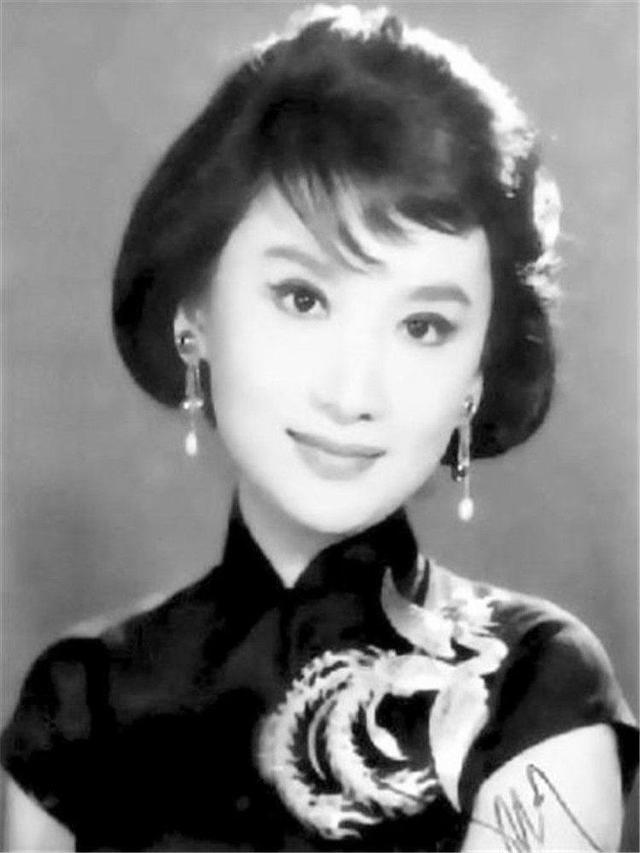

# 夏梦

夏梦原名杨濛，香港公认的西施演员，国语片罕见的全能演员，她擅演擅唱，不论时装、古装、戏曲电影皆能胜任，可见其实力所在。那么，夏梦年轻时有多美？简直在发光，难怪金庸对她一见钟情。

夏梦的一生事业辉煌，代表了上世纪50至60年代的香港电影历史，并以绝代美貌与精湛演技而著称影界，与石慧、陈思思合称“长城三公主”。

关于夏梦的美貌，正如金庸所说，“**西施怎样美丽，谁也没见过，我想她应该像夏梦才名不虚传。**”连李翰祥也感叹，“夏梦是中国电影有史以来最漂亮的女演员，气质不凡，令人沉醉。”

夏梦是金庸一生最爱的美女，黄蓉和小龙女的原型，传统士大夫心中理想女性的化身，承载民国文人家国梦想的梦中情人，只能用风华绝代、倾国倾城、雍容华贵这些词来形容，她如同落入凡间的仙女，美了一个世纪。

