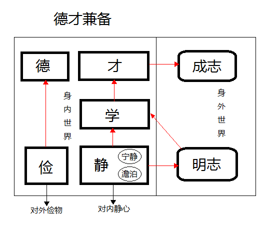

# 诫子书

## 介绍

《诫子书》是诸葛亮在离世前一年，写给儿子诸葛瞻的一段话。全文仅仅80余字，却成为了中华两千年来最著名的家训之一，也是最精短的家训之一。诸葛亮不仅生前有着非凡的历程，更有着身后的千古美名，被誉为“智慧的化身”。他的后裔没有一个败家子，而是人才辈出。诸葛瞻、诸葛尚父子殉难于邓艾伐蜀的绵竹之战，十八世后诸葛大师匠心独运的八卦村，极为神奇，历经数百年而幸免于兵火，必然处处内蕴玄机。至今诸葛村的人都秉承了淳朴善良的本性，且都能医善文。《诫子书》融汇了一代高人的心血与智慧，对诸葛世家影响深远。

## 原文

夫君子之行，静以修身，俭以养德。非澹泊无以明志，非宁静无以致远。夫学须静也，才须学也。非学无以广才，非志无以成学。淫慢则不能励精，险躁则不能冶性。年与时驰，意与日去，遂成枯落，多不接世，悲守穷庐，将复何及！

## 我的理解

我的理解1

- 夫君子之行，静以修身，俭以养德。非澹泊无以明志，非宁静无以致远。夫学须静也，才须学也。

> 从正面说，都是正向的：静->明志（明确志向）->学->才->成志（成就志向）

- 非学无以广才，非志无以成学。淫慢则不能励精，险躁则不能冶性。年与时驰，意与日去，遂成枯落，多不接世，悲守穷庐，将复何及！

> 从反面说，如果不怎么怎么样，将会怎么怎么样。

> 我觉得，“静以修身，俭以养德”是一个“德才兼备”的目标。“俭以养德”的目标就是“德”；而“静以修身”的目标是“修身”，这个“修身”和“才”有什么关系呢？我是觉得，得联系下文“夫学须静也，才须学也”，可见是一个“静->学->才”，所以我觉得，这里的“修身”是“修习知识，成为人才”。

> 我的理解：  
> 俭，是对外在物质的节约，不浪费物品；  
> 静，是对内在心性的节制，我觉得，“澹泊”和“宁静”都是属于“静”的范围。  
> 澹泊，就是把名、利放淡然，不被看不见的“虚妄”所索引；  
> 宁静，就是内心安定、平静  

我的理解2

- 夫君子之行，静以修身，俭以养德。

> 静->修身； 俭->养德  
> 问题：如何算“静”，如何算“俭”？ 当是“心静”、“物俭”。

- 非澹泊无以明志，非宁静无以致远。
- 夫学须静也，才须学也。非学无以广才，非志无以成学。

> 静->学->才

- 淫慢则不能励精，险躁则不能冶性。
- 年与时驰，意与日去，遂成枯落，多不接世，悲守穷庐，将复何及！

## 《诫子书》的非凡力量

从《诫子书》中，我们细细品读与领悟，可窥知它传递了非同寻常的力量。

### 第一：宁静的力量

“静以修身”、“非宁静无以致远”、“学须静也”。诸葛亮忠告孩子宁静才能够修养身心，静思反省。若不能够静下来，则无法有效的计划未来，也不可能安心学习。只有环境安宁，内心安静时，才能高效的学习与深沉的反思。而现代人大多数终日忙碌，为名、为利、为情，精疲力竭，何以反思？

> 便是一个“静”字，当是“心静”之意，是指人的内在的那颗心。

### 第二：节俭的力量

“俭以养德”。诸葛亮忠告孩子要节俭，以培养德行。谨慎理财，量入为出，不可铺张，既摆脱负债的困扰，又可过着自律的简朴生活，不成为物质的奴隶。而在鼓励消费的今日社会，各种浪费惊人，节俭被耻笑，被视为吝啬，导致资源极度紧张。

> 便是一个“俭”字，当是“物俭”之意，是指人对外在物质（金钱、衣食等）节省。

### 第三：计划的力量

“非澹泊无以明志”、“非宁静无以致远”。诸葛亮忠告孩子要计划人生，不要事事讲求名利，才能够了解自己的志向，要静下来，才能够细心计划将来。面对未来，要有理想，有使命感，有自己正确的价值观。

> “澹泊”是指对外，对外物（名利、情色）的欲求减少；“宁静”是对内，对内心保持一片安静。  
> 减少了对外的欲求，也就有助于内心的安定。
> 对外的欲求少了，也就更加明白自己想要什么（明志），确定未来的方向；也只有心安定（宁静）下来，才能在既定的目标（明志）上继续前进。

> 澹泊（dàn bó），指清静寡欲，不追求功名利禄。  
> 澹（dàn）。（1）本义：水波摇动的样子。澹,水摇也。——《说文》 （2）通“淡”，指恬静、安然的样子。
> 泊（bó）。本义：停船。

### 第四：学习的力量

“夫学须静也”、“才须学也”。诸葛亮忠告孩子宁静的环境对学习大有帮助，当然配合专注的平静心境，就更加事半功倍。诸葛亮不是天才论的信徒，他相信才能是学习的结果。即要全心全力的学习才会有成就。

> 静->学->才  
> “俭”是对看得到的、有形物质的节约  
> “澹泊”是对看不到的、无形欲求的节制  
> “俭”和“澹泊”共同的目的是达到“静”，就是“心态平静”  
> 唯有“静”，方才进修“学”业  
> 唯有“学”，方能造可用之“才”

### 第五：增值的力量

“非学无以广才”、“非志无以成学”。诸葛亮忠告孩子要增值先要立志，不愿意努力学习，就不能够增加自己的才干。但学习的过程中，决心和毅力非常重要，因为缺乏了意志力，就会半途而废。要一鼓作气坚持到底，必得大收获。

> 志->学->才  
> 我觉得，这里的“志”并不是“决心和毅力”，而是“志向”，也就是学习的“目标、方向”  
> 有了“志”（目标、方向），才收集相关的知识（学），以广博自己的见解并转换为自己的才能

### 第六课：速度的力量

“淫慢则不能励精”。诸葛亮忠告孩子凡事拖延就不能够快速的掌握要点，今日事今日毕。在电子技术极为发达时代，事情都讲求效率。你比别人快一步，不但能达成理想，还可有更多时间去修正及改善，更加完美。

> 淫。久雨爲淫。过多，过甚：～辞。～雨。～威。  
> 励，通“砺”，磨炼。  
> 精，物质中最纯粹的部分，提炼出来的东西：～华。～英。  
> 励精，我的理解是“磨砺精细”，把学业弄的清楚细致。  
> 我对于这句话的理解是，如果你贪多，学习的会慢，而且你不能把知识点理不清楚，所谓“贪多嚼不烂”。  
> 可能是不对的理解：“淫慢”，或许表示你的兴趣太多，这也一定程度上说明了你的“志”不“明”。作者可能希望你，通过“澹泊”来“明志”，但正是由于你的“志”不明，才导致你的兴趣多，即所谓“淫慢”。

### 第七课：性格的力量

“险躁则不能冶性”。诸葛亮忠告孩子太过急躁就不能够陶冶性情。有说：“思想影响行为，行为影响习惯，习惯影响性格，性格影响命运。”生命中要作出种种平衡，要“励精”，也要“冶性”，才能有效提升自己性格的品质。

> 险躁（xiǎn zào），指轻薄浮躁。  
> 险。本义：地势高低悬殊,难以通过。险,阻难也。——《说文》  
> 躁，疾也。——《说文》。  
> 言未及之而言谓之躁。——《论语》。郑注:“不安静也。”  
> 冶（yě），熔炼金属：～炼。～铸。～金。  
> “险躁”，我的理解是这样的：修学之路，好比跋山涉水，总会遇到地势高低悬殊、难以通行的地方（换句话说，你现有的知识储备，不足以理解当前的知识点），这也恰恰一个熔炼你的性情的好机会；此时，如果你心也浮，气也躁，一来，你的性情得不到磨砺，二来，这个知识点，你可能学不到什么东西。如果你心也平、气也和，虽说你不一定能够全部理解，但通过你的努力探索，终究有所收获。  
> 这仍然是一个“心不静”的问题，从“静”的反面去说。

### 第八课：时间的力量

“年与时驰”、“意与岁去”。诸葛亮忠告孩子时光飞逝，意志力又会随着时间消磨，“少壮不努力，老大徒伤悲”。时间本身不可被管理，每天二十四小时，但可管理自己，善用每分每秒，不蹉跎时间。尤其当今时代，各种信息如核弹爆炸，垃圾信息也充斥角角落落，更需把有限的时间用在最有价值与意义的事上。人生百年，转瞬即逝。

> “年”和“意”是自己的东西，自己的年龄、自己的志向。  
> “时”和“岁”是客观的事物，客观的时间、客观的岁月。  
> “驰”和“去”都表示流逝，时间的飞驰，岁月的逝去。

### 第九：想象的力量

“遂成枯落”、“多不接世”、“悲守穷庐”、“将复何及”。诸葛亮忠告孩子时光飞逝，当自己变得和世界脱节，才悲叹蹉跎岁月，也于事无补。要懂得居安思危，才能够临危不乱。想象力比知识更有力量。要从大处着想，小处着手，脚踏实地，走好人生之路。

> 枯落（自身视野）->世（天下视野）->穷庐（房间视野）

> 枯落，汉语词汇，意思是凋落、衰残。出自于汉代董仲舒 所作《春秋繁露·阴阳义》  
> 汉 董仲舒 《春秋繁露·阴阳义》：“是故天之道以三时成生，以一时丧死。死之者，谓百物枯落也；丧之者，谓阴气悲哀也。”  
> 我理解，“枯”是指“草”将枯死，而“落”是指“树”落叶子。

> 多不接世，对天下没有任何贡献。  
> 可能不对的理解，我想到了“接济”，我猜测“接”和“济”表示同一个意思，但是没有查到“接”字有这个意思。正所谓，“穷则独善其身，达则兼济天下”，其中有“济天下”，应该就是以自己的才学来回报天下众人。

> 穷庐（qíong lú），是指破房子。

> 将复何及，后悔也来不及了。  
> 将，打算。  
> 复，还原，使如前，再，重来。

### 第十：精简的力量

这封信，短短八十六字，精简地传递了具体的讯息。长篇大论容易令人生厌，精简沟通效果更佳。尤其在当下，精简沟通才更具效力。

> 所谓，言简意赅。
