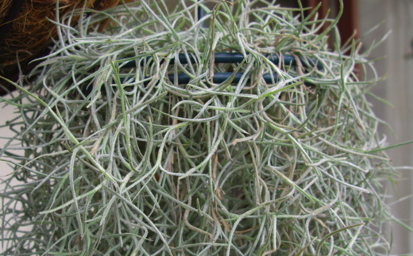
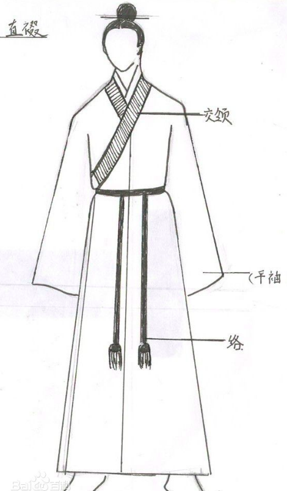

# 第014回·心猿归正 六贼无踪

诗曰：

- 佛即心兮心即佛，心佛从来皆要物。

> 前半句应该是说“修心”，但后半句没有懂。“心佛”是一个整体概念，还是两个概念呢，“皆要物”是什么意思呢？

- 若知无物又无心，便是真如法身佛。

> 前半句涉及到两个概念“物”和“心”，后半句提到一个概念“法身佛”  
> 法身佛，即毗卢遮那佛，汉译“大日如来”，是佛教密宗至高无上的本尊，是密宗最高阶层的佛。

- 法身佛，没模样，一颗圆光涵万象。

> 圆光，是佛、菩萨及诸圣神头后的光圈。  
> 涵（hán），通常指包容蕴藏，

- 无体之体即真体，无相之相即实相。
- 非色非空非不空，不来不向不回向。
- 无异无同无有无，难舍难取难听望。
- 内外灵光到处同，一佛国在一沙中。
- 一粒沙含大千界，一个身心万法同。
- 知之须会无心诀，不染不滞为净业。
- 善恶千端无所为，便是南无释迦叶。

却说那刘伯钦与唐三藏惊惊慌慌，又闻得叫声师父来也。众家僮道：“这叫的必是那山脚下石匣中老猿。”太保道：“是他，是他！”三藏问：“是什么老猿？”太保道：“这山旧名五行山，因我大唐王征西定国，改名两界山。先年间曾闻得老人家说：‘王莽篡汉之时，天降此山，下压着一个神猴，不怕寒暑，不吃饮食，自有土神监押，教他饥餐铁丸，渴饮铜汁。自昔到今，冻饿不死。’这叫必定是他。长老莫怕，我们下山去看来。”三藏只得依从，牵马下山。行不数里，只见那石匣之间，果有一猴，露着头，伸着手，乱招手道：“师父，你怎么此时才来？来得好，来得好！救我出来，我保你上西天去也！”这长老近前细看，你道他是怎生模样——

> 五行山，又名两界山。

尖嘴缩腮，金睛火眼。头上堆苔藓，耳中生薜萝。鬓边少发多青草，颔下无须有绿莎。眉间土，鼻凹泥，十分狼狈，指头粗，手掌厚，尘垢余多。还喜得眼睛转动，喉舌声和。语言虽利便，身体莫能那。正是五百年前孙大圣，今朝难满脱天罗。

> 看下面的图，理解一下“尖嘴缩腮”

> 关于“金睛火眼”，我是这么理解的，“眼”是整体，是指整个眼珠，而“睛”是局部，是眼珠中间的部分。猜测的依据是“画龙点睛”中的“睛”，说的应该是眼已经画好了，只差点“睛”之笔了。

> 薜萝（bì luó），意思为薜荔和女萝。  
> 薜荔（bì lì），耐贫瘠，抗干旱，对土壤要求不严格，适应性强，幼株耐阴。「生长地方」多攀附在村庄前后、山脚、大树上、断墙残壁、古石桥、庭院围墙等。「对于地貌不敏感」无论山区、丘陵、平原，在土壤湿润肥沃的地区都有野生薜荔分布。

> 女萝（nǚ luó）是一种地衣类植物，全体为无数细枝，状如线，长数尺，靠依附他物生长。「生长环境」寄生于田边、路旁的豆科、菊科蒿子、马鞭草科牡荆属等草本或小灌木上，海拔50-2000米。

> 绿莎，拼音lǜ shā，汉语词汇，意指绿色的莎草。  
> 莎草，不是一种植物，而是多种植物的别称，多生长在潮湿处或沼泽地。

这太保诚然胆大，走上前来，与他拔去了鬓边草，颔下莎，问道：“你有什么说话？”那猴道：“我没话说，教那个师父上来，我问他一问。”三藏道：“你问我什么？”那猴道：“你可是东土大王差往西天取经去的么？”三藏道：“我正是，你问怎么？”那猴道：“我是五百年前大闹天宫的齐天大圣，只因犯了诳上之罪，被佛祖压于此处。前者有个观音菩萨，领佛旨意，上东土寻取经人。我教他救我一救，他劝我再莫行凶，归依佛法，尽殷勤保护取经人，往西方拜佛，功成后自有好处。故此昼夜提心，晨昏吊胆，只等师父来救我脱身。我愿保你取经，与你做个徒弟。”三藏闻言，满心欢喜道：“你虽有此善心，又蒙菩萨教诲，愿入沙门，只是我又没斧凿，如何救得你出？”那猴道：“不用斧凿，你但肯救我，我自出来也。”三藏道：“我自救你，你怎得出来？”那猴道：“这山顶上有我佛如来的金字压帖。你只上山去将帖儿揭起，我就出来了。”三藏依言，回头央浼刘伯钦道：“太保啊，我与你上山走一遭。”伯钦道：“不知真假何如！”那猴高叫道：“是真！决不敢虚谬！”伯钦只得呼唤家僮，牵了马匹。他却扶着三藏，复上高山，攀藤附葛，只行到那极巅之处，果然见金光万道，瑞气千条，有块四方大石，石上贴着一封皮，却是“唵、嘛、呢、叭、咪、吽”六个金字。

> 诳上（kuáng shàng），欺骗君上、尊长。  
> “昼夜提心，晨昏吊胆”，这个句子用的好，把“提心吊胆”分开用，而“昼、夜、晨、昏”都是时间，“昼、夜”是分别是整个白天、黑天，而“晨、昏”是“昼夜”进行交替的时刻。  
> 央浼（yāng měi），指不断地请求，恳求。  
> 攀藤附葛（pān téng fù gě），攀附着藤葛前进，极言道路艰难。其中，“攀、附”都是动词，而“藤、葛”两者都是“草”字头，可见都是植物。对于“藤”和“葛”，我不是特别清楚，不过有一点可以分开，就是“藤”常用来做“藤椅、藤床、藤篮”，而“葛”呢，常以葛为原料制成的布、衣、带等。

三藏近前跪下，朝石头，看着金字，拜了几拜，望西祷祝道：“弟子陈玄奘，特奉旨意求经，果有徒弟之分，揭得金字，救出神猴，同证灵山。若无徒弟之分，此辈是个凶顽怪物，哄赚弟子，不成吉庆，便揭不得起。”祝罢，又拜。拜毕，上前将六个金字轻轻揭下。只闻得一阵香风，劈手把压帖儿刮在空中，叫道：“吾乃监押大圣者。今日他的难满，吾等回见如来，缴此封皮去也。”吓得个三藏与伯钦一行人，望空礼拜。径下高山，又至石匣边，对那猴道：“揭了压帖矣，你出来么。”

> 祷祝，应该是一个“动名”词。“祷”，是指人向天、神求助、求福；而“祝”是人对事的美好愿望。

那猴欢喜，叫道：“师父，你请走开些，我好出来，莫惊了你。”伯钦听说，领着三藏，一行人回东即走。走了五七里远近，又听得那猴高叫道：“再走，再走！”三藏又行了许远，下了山，只闻得一声响亮，真个是地裂山崩。众人尽皆悚惧，只见那猴早到了三藏的马前，赤淋淋跪下，道声：“师父，我出来也！”对三藏拜了四拜，急起身，与伯钦唱个大喏道：“有劳大哥送我师父，又承大哥替我脸上薅草。”谢毕，就去收拾行李，扣背马匹。那马见了他，腰软蹄矬，战兢兢的立站不住。盖因那猴原是弼马温，在天上看养龙马的，有些法则，故此凡马见他害怕。

> 薅（hāo），是去掉之意。如薅草，即拔草。

三藏见他意思，实有好心，真个象沙门中的人物，便叫：“徒弟啊，你姓什么？”猴王道：“我姓孙。”三藏道：“我与你起个法名，却好呼唤。”猴王道：“不劳师父盛意，我原有个法名，叫做孙悟空。”三藏欢喜道：“也正合我们的宗派。你这个模样，就象那小头陀一般，我再与你起个混名，称为行者，好么？”悟空道：“好，好，好！”自此时又称为孙行者。那伯钦见孙行者一心收拾要行，却转身对三藏唱个喏道：“长老，你幸此间收得个好徒，甚喜甚喜，此人果然去得。我却告回。”三藏躬身作礼相谢道：“多有拖步，感激不胜。回府多多致意令堂老夫人，令荆夫人，贫僧在府多扰，容回时踵谢。”伯钦回礼，遂此两下分别。

> 法名，宗教语，指和尚或道士出家之后由师傅根据谱排起的名字，是道号和法号的统称。  

> 拖步（tuō bù），指劳驾。  

> 令尊，是指对方的父亲，尊称。  
> 令堂，指对别人母亲的尊称，敬辞。  
> 令荆，是指对方的妻子，尊称。称自己夫人时用“拙荆”，是谦称。  
> 令爱，是指对方的女儿，又作“令嫒”。  
> 令郎，是指对方的儿子。称自己的儿子时用“犬子”，是谦称。  
> 令亲，是指对方的亲戚，敬辞。

> 踵谢（zhǒng xiè），意思为登门道谢。只是不知，后文回来时，是否再遇刘伯钦？

却说那孙行者请三藏上马，他在前边，背着行李，赤条条，拐步而行。不多时，过了两界山，忽然见一只猛虎，咆哮剪尾而来，三藏在马上惊心。行者在路旁欢喜道：“师父莫怕他，他是送衣服与我的。”放下行李，耳朵里拔出一个针儿，迎着风，幌一幌，原来是个碗来粗细一条铁棒。他拿在手中，笑道：“这宝贝，五百余年不曾用着他，今日拿出来挣件衣服儿穿穿。”你看他拽开步，迎着猛虎，道声：“业畜，那里去！”那只虎蹲着身，伏在尘埃，动也不敢动动。却被他照头一棒，就打的脑浆迸万点桃红，牙齿喷几珠玉块，唬得那陈玄奘滚鞍落马，咬指道声：“天哪，天哪！刘太保前日打的斑斓虎，还与他斗了半日。今日孙悟空不用争持，把这虎一棒打得稀烂，正是强中更有强中手！”

> 赤条条，孙行者还没有衣服。  
> 拐步而行，应该是说孙行者走路的样子，想像一下猴子走路的样子。  
> 不明白“咆哮剪尾”中的“剪尾”是什么意思  
> 业畜，作恶的畜牲。

行者拖将虎来道：“师父略坐一坐，等我脱下他的衣服来，穿了走路。”三藏道：“他那里有甚衣服？”行者道：“师父莫管我，我自有处置。”好猴王，把毫毛拔下一根，吹口仙气，叫：“变！”变作一把牛耳尖刀，从那虎腹上挑开皮，往下一剥，剥下个囫囵皮来，剁去了爪甲，割下头来，割个四四方方一块虎皮，提起来，量了一量道：“阔了些儿，一幅可作两幅。”拿过刀来，又裁为两幅。收起一幅，把一幅围在腰间，路旁揪了一条葛藤，紧紧束定，遮了下体道：“师父，且去，且去！到了人家，借些针线，再缝不迟。”他把条铁棒，捻一捻，依旧象个针儿，收在耳里，背着行李，请师父上马。

> 这段对话，却是“好笑”：脱老虎的衣服

> 下面是个“牛耳尖刀”，这刀主要就是用来对猎物进行剥皮的，庖丁用的刀应该就是这样。

两个前进，长老在马上问道：“悟空，你才打虎的铁棒，如何不见？”行者笑道：“师父，你不晓得。我这棍，本是东洋大海龙宫里得来的，唤做天河镇底神珍铁，又唤做如意金箍棒。当年大反天宫，甚是亏他。随身变化，要大就大，要小就小。刚才变做一个绣花针儿模样，收在耳内矣。但用时，方可取出。”三藏闻言暗喜。又问道：“方才那只虎见了你，怎么就不动动，让自在打他，何说？”悟空道：“不瞒师父说，莫道是只虎，就是一条龙，见了我也不敢无礼。我老孙，颇有降龙伏虎的手段，翻江搅海的神通，见貌辨色，聆音察理，大之则量于宇宙，小之则摄于毫毛！变化无端，隐显莫测。剥这个虎皮，何为稀罕？见到那疑难处，看展本事么！”三藏闻得此言，愈加放怀无虑，策马前行。师徒两个走着路，说着话，不觉得太阳星坠。但见——

> “我老孙，颇有降龙伏虎的手段”，后文白龙马的时候，唐僧就提到了。  
> 见貌辨色（jiàn mào biàn sè），意思是根据对方的脸色、表情行事。  
> 聆音察理（líng yīn chá lǐ），听到声音就能明察事理。指善于分析。

- 焰焰斜辉返照，天涯海角归云。千山鸟雀噪声频，觅宿投林成阵。
- 野兽双双对对，回窝族族群群。一勾新月破昏，万点明星光晕。

行者道：“师父走动些，天色晚了。那壁厢树木森森，想必是人家庄院，我们赶早投宿去来。”三藏果策马而行，径奔人家，到了庄院前下马。行者撇了行李，走上前，叫声：“开门，开门！”那里面有一老者，扶筇而出，唿喇的开了门，看见行者这般恶相，腰系着一块虎皮，好似个雷公模样，唬得脚软身麻，口出谵语道：“鬼来了，鬼来了！”三藏近前搀住叫道：“老施主，休怕。他是我贫僧的徒弟，不是鬼怪。”老者抬头，见了三藏的面貌清奇，方然立定，问道：“你是那寺里来的和尚，带这恶人上我门来？”三藏道：“我贫僧是唐朝来的，往西天拜佛求经，适路过此间，天晚，特造檀府借宿一宵，明早不犯天光就行。万望方便一二。”老者道：“你虽是个唐人，那个恶的却非唐人。”悟空厉声高呼道：“你这个老儿全没眼色！唐人是我师父，我是他徒弟！我也不是甚糖人蜜人，我是齐天大圣。你们这里人家，也有认得我的，我也曾见你来。”那老者道：“你在那里见我？”悟空道：“你小时不曾在我面前扒柴？不曾在我脸上挑菜？”老者道：“这厮胡说！你在那里住？我在那里住？我来你面前扒柴挑菜！”悟空道：“我儿子便胡说！你是认不得我了，我本是这两界山石匣中的大圣。你再认认看。”老者方才省悟道：“你倒有些象他，但你是怎么得出来的？”悟空将菩萨劝善、令我等待唐僧揭帖脱身之事，对那老者细说了一遍。老者却才下拜，将唐僧请到里面，即唤老妻与儿女都来相见，具言前事，个个欣喜。又命看茶，茶罢，问悟空道：“大圣啊，你也有年纪了？”悟空道：“你今年几岁了？”老者道：“我痴长一百三十岁了。”行者道：“还是我重子重孙哩！我那生身的年纪，我不记得是几时，但只在这山脚下，已五百余年了。”老者道：“是有，是有。我曾记得祖公公说，此山乃从天降下，就压了一个神猴。只到如今，你才脱体。我那小时见你，是你头上有草，脸上有泥，还不怕你。如今脸上无了泥，头上无了草，却象瘦了些，腰间又苫了一块大虎皮，与鬼怪能差多少？”

> 筇（qióng），一种竹，实心，节高，宜于作拐杖。  
> 唿喇（hū lǎ），释义为唿啦。  
> 谵语（zhān yǔ），指病中的神志不清、胡言乱语。  
> 檀府（tán fǔ），僧人对施主住宅的敬称。  
> 苫（shàn），用席、布等遮盖。

一家儿听得这般话说，都呵呵大笑。这老儿颇贤，即令安排斋饭。饭后，悟空道：“你家姓甚？”老者道：“舍下姓陈。”三藏闻言，即下来起手道：“老施主，与贫僧是华宗。”行者道：“师父，你是唐姓，怎的和他是华宗？”三藏道：“我俗家也姓陈，乃是唐朝海州弘农郡聚贤庄人氏。我的法名叫做陈玄奘。只因我大唐太宗皇帝赐我做御弟三藏，指唐为姓，故名唐僧也。”那老者见说同姓，又十分欢喜。行者道：“老陈，左右打搅你家。我有五百多年不洗澡了，你可去烧些汤来，与我师徒们洗浴洗浴，一发临行谢你。”那老儿即令烧汤拿盆，掌上灯火。师徒浴罢，坐在灯前，行者道：“老陈，还有一事累你，有针线借我用用。”那老儿道：“有，有，有。”即教妈妈取针线来，递与行者。行者又有眼色，见师父洗浴，脱下一件白布短小直裰未穿，他即扯过来披在身上，却将那虎皮脱下，联接一处，打一个马面样的折子，围在腰间，勒了藤条，走到师父面前道：“老孙今日这等打扮，比昨日如何？”三藏道：“好，好，好！这等样，才象个行者。”三藏道：“徒弟，你不嫌残旧，那件直裰儿，你就穿了罢。”悟空唱个喏道：“承赐，承赐！”他又去寻些草料喂了马。此时各各事毕，师徒与那老儿，亦各归寝。

> 华宗，对同族或同姓者的美称。  
> 此处竟有“聚贤庄”

> 直裰（zhí duō），从宋朝开始就有的一种汉服服饰，而到了明朝时期，直裰的款式发生变化，在文人、士大夫中流行。  
> 直缀，又作直裰，系僧侣之法衣一种，即将偏衫与裙子合缀而成之僧服。我国唐代中世以来，即盛行于禅宗。

次早，悟空起来，请师父走路。三藏着衣，教行者收拾铺盖行李。正欲告辞，只见那老儿，早具脸汤，又具斋饭。斋罢，方才起身。三藏上马，行者引路，不觉饥餐渴饮，夜宿晓行，又值初冬时候。但见那——

> “饥餐渴饮，夜宿晓行”，这8个字真是言简意赅。

- 霜凋红叶千林瘦，岭上几株松柏秀。未开梅蕊散香幽，暖短昼，小春候，菊残荷尽山茶茂。
- 寒桥古树争枝斗，曲涧涓涓泉水溜。淡云欲雪满天浮，朔风骤，牵衣袖，向晚寒威人怎受？

> “霜凋红叶千林瘦”，这句写的好啊！！！

师徒们正走多时，忽见路旁唿哨一声，闯出六个人来，各执长枪短剑，利刃强弓，大咤一声道：“那和尚，那里走！赶早留下马匹，放下行李，饶你性命过去！”唬得那三藏魂飞魄散，跌下马来，不能言语。行者用手扶起道：“师父放心，没些儿事，这都是送衣服送盘缠与我们的。”三藏道：“悟空，你想有些耳闭？他说教我们留马匹、行李，你倒问他要什么衣服、盘缠？”行者道：“你管守着衣服、行李、马匹，待老孙与他争持一场，看是何如。”三藏道：“好手不敌双拳，双拳不如四手。他那里六条大汉，你这般小小的一个人儿，怎么敢与他争持？”

> “悟空，你想有些耳闭？”，师徒二人对话，真是有趣的紧！！！

行者的胆量原大，那容分说，走上前来，叉手当胸，对那六个人施礼道：“列位有什么缘故，阻我贫僧的去路？”那人道：“我等是剪径的大王，行好心的山主。大名久播，你量不知，早早的留下东西，放你过去。若道半个不字，教你碎尸粉骨！”行者道：“我也是祖传的大王，积年的山主，却不曾闻得列位有甚大名。”那人道：“你是不知，我说与你听：一个唤做眼看喜，一个唤做耳听怒，一个唤做鼻嗅爱，一个唤作舌尝思，一个唤作意见欲，一个唤作身本忧。”悟空笑道：“原来是六个毛贼！你却不认得我这出家人是你的主人公，你倒来挡路。把那打劫的珍宝拿出来，我与你作七分儿均分，饶了你罢！”那贼闻言，喜的喜，怒的怒，爱的爱，思的思，欲的欲，忧的忧，一齐上前乱嚷道：“这和尚无礼！你的东西全然没有，转来和我等要分东西！”他轮枪舞剑，一拥前来，照行者劈头乱砍，乒乒乓乓，砍有七八十下。悟空停立中间，只当不知。那贼道：“好和尚！真个的头硬！”行者笑道：“将就看得过罢了！你们也打得手困了，却该老孙取出个针儿来耍耍。”那贼道：“这和尚是一个行针灸的郎中变的。我们又无病症，说什么动针的话！”行者伸手去耳朵里拔出一根绣花针儿，迎风一幌，却是一条铁棒，足有碗来粗细，拿在手中道：“不要走！也让老孙打一棍儿试试手！”唬得这六个贼四散逃走，被他拽开步，团团赶上，一个个尽皆打死。剥了他的衣服，夺了他的盘缠，笑吟吟走将来道：“师父请行，那贼已被老孙剿了。”

> 剪径（jiǎn jìng），指拦路抢劫。  
> “把那打劫的珍宝拿出来，我与你作七分儿均分，饶了你罢！”，孙行者倒是“反客为主”，哈哈

三藏道：“你十分撞祸！他虽是剪径的强徒，就是拿到官司，也不该死罪。你纵有手段，只可退他去便了，怎么就都打死？这却是无故伤人的性命，如何做得和尚？出家人扫地恐伤蝼蚁命，爱惜飞蛾纱罩灯。你怎么不分皂白，一顿打死？全无一点慈悲好善之心！早还是山野中无人查考，若到城市，倘有人一时冲撞了你，你也行凶，执着棍子，乱打伤人，我可做得白客，怎能脱身？”悟空道：“师父，我若不打死他，他却要打死你哩。”三藏道：“我这出家人，宁死决不敢行凶。我就死，也只是一身，你却杀了他六人，如何理说？此事若告到官，就是你老子做官，也说不过去。”行者道：“不瞒师父说，我老孙五百年前，据花果山称王为怪的时节，也不知打死多少人。假似你说这般到官，倒也得些状告是。”三藏道：“只因你没收没管，暴横人间，欺天诳上，才受这五百年前之难。今既入了沙门，若是还象当时行凶，一味伤生，去不得西天，做不得和尚。忒恶，忒恶！”

原来这猴子一生受不得人气，他见三藏只管绪绪叨叨，按不住心头火发道：“你既是这等，说我做不得和尚，上不得西天，不必恁般绪浩恶我，我回去便了！”那三藏却不曾答应，他就使一个性子，将身一纵，说一声：“老孙去也！”三藏急抬头，早已不见，只闻得呼的一声，回东而去。撇得那长老孤孤零零，点头自叹，悲怨不已，道：“这厮，这等不受教诲！我但说他几句，他怎么就无形无影的，径回去了？罢，罢，罢！也是我命里不该招徒弟，进人口！如今欲寻他无处寻，欲叫他叫不应，去来，去来！”正是舍身拚命归西去，莫倚旁人自主张。

> “原来这猴子一生受不得人气”，这不正好是在说我自己吗？！！！别人一说自己，自己就不爱听。只把好话当歹话听，全然不记得“有则改之，无则嘉勉”。心中要能容得下才行。

那长老只得收拾行李，捎在马上，也不骑马，一只手拄着锡杖，一只手揪着缰绳，凄凄凉凉，往西前进。行不多时，只见山路前面，有一个年高的老母，捧一件绵衣，绵衣上有一顶花帽。三藏见他来得至近，慌忙牵马，立于右侧让行。那老母问道：“你是那里来的长老，孤孤凄凄独行于此？”三藏道：“弟子乃东土大唐奉圣旨往西天拜活佛求真经者。”老母道：“西方佛乃大雷音寺天竺国界，此去有十万八千里路。你这等单人独马，又无个伴侣，又无个徒弟，你如何去得！”三藏道：“弟子日前收得一个徒弟，他性泼凶顽，是我说了他几句，他不受教，遂渺然而去也。”老母道：“我有这一领绵布直裰，一顶嵌金花帽，原是我儿子用的。他只做了三日和尚，不幸命短身亡。我才去他寺里，哭了一场，辞了他师父，将这两件衣帽拿来，做个忆念。长老啊，你既有徒弟，我把这衣帽送了你罢。”三藏道：“承老母盛赐，但只是我徒弟已走了，不敢领受。”老母道：“他那厢去了？”三藏道：“我听得呼的一声，他回东去了。”老母道：“东边不远，就是我家，想必往我家去了。我那里还有一篇咒儿，唤做定心真言，又名做紧箍儿咒。你可暗暗的念熟，牢记心头，再莫泄漏一人知道。我去赶上他，叫他还来跟你，你却将此衣帽与他穿戴。他若不服你使唤，你就默念此咒，他再不敢行凶，也再不敢去了。”三藏闻言，低头拜谢。

> 定心真言 = 紧箍儿咒

那老母化一道金光，回东而去。三藏情知是观音菩萨授此真言，急忙撮土焚香，望东恳恳礼拜。拜罢，收了衣帽，藏在包袱中间，却坐于路旁，诵习那定心真言。来回念了几遍，念得烂熟，牢记心胸不题。

> 情知，指深知、明知的意思  
> 撮土焚香（cuō tǔ fén xiāng），指旧时人在野外撮土代替香炉，烧香敬神。

却说那悟空别了师父，一筋斗云，径转东洋大海。按住云头，分开水道，径至水晶宫前。早惊动龙王出来迎接，接至宫里坐下。礼毕，龙王道：“近闻得大圣难满，失贺！想必是重整仙山，复归古洞矣。”悟空道：“我也有此心性，只是又做了和尚了。”龙王道：“做甚和尚？”行者道：“我亏了南海菩萨劝善，教我正果，随东土唐僧，上西方拜佛，皈依沙门，又唤为行者了。”龙王道：“这等真是可贺，可贺！这才叫做改邪归正，惩创善心。既如此，怎么不西去，复东回何也？”行者笑道：“那是唐僧不识人性。有几个毛贼剪径，是我将他打死，唐僧就绪绪叨叨，说了我若干的不是。你想老孙，可是受得闷气的？是我撇了他，欲回本山。故此先来望你一望，求钟茶吃。”龙王道：“承降，承降！”当时龙子龙孙即捧香茶来献。

茶毕，行者回头一看，见后壁上挂著一幅“圯桥进履”的画儿。行者道：“这是什么景致？”龙王道：“大圣在先，此事在后，故你不认得。这叫做圯桥三进履。”行者道：“怎的是三进履？”龙王道：“此仙乃是黄石公，此子乃是汉世张良。石公坐在圯桥上，忽然失履于桥下，遂唤张良取来。此子即忙取来，跪献于前。如此三度，张良略无一毫倨傲怠慢之心，石公遂爱他勤谨，夜授天书，着他扶汉。后果然运筹帷幄之中，决胜千里之外。太平后，弃职归山，从赤松子游，悟成仙道。大圣，你若不保唐僧，不尽勤劳，不受教诲，到底是个妖仙，休想得成正果。”悟空闻言，沉吟半晌不语。龙王道：“大圣自当裁处，不可图自在，误了前程。”悟空道：“莫多话，老孙还去保他便了。”龙王欣喜道：“既如此，不敢久留，请大圣早发慈悲，莫要疏久了你师父。”行者见他催促请行，急耸身，出离海藏，驾着云，别了龙王。

> 圯桥（yí qiáo），坐落在有着近五千年历史的文化名城下邳（今江苏省睢宁县古邳镇境内）。  
> 圯（yí），也是指“桥”。  
> “大圣，你若不保唐僧，不尽勤劳，不受教诲，到底是个妖仙，休想得成正果。”，此言有理！！！

正走，却遇着南海菩萨。菩萨道：“孙悟空，你怎么不受教诲，不保唐僧，来此处何干？”慌得个行者在云端里施礼道：“向蒙菩萨善言，果有唐朝僧到，揭了压帖，救了我命，跟他做了徒弟。他却怪我凶顽，我才闪了他一闪，如今就去保他也。”菩萨道：“赶早去，莫错过了念头。”言毕各回。

这行者，须臾间看见唐僧在路旁闷坐。他上前道：“师父！怎么不走路？还在此做甚？”三藏抬头道：“你往那里去来？教我行又不敢行，动又不敢动，只管在此等你。”行者道：“我往东洋大海老龙王家讨茶吃吃。”三藏道：“徒弟啊，出家人不要说谎。你离了我，没多一个时辰，就说到龙王家吃茶？”行者笑道：“不瞒师父说，我会驾筋斗云，一个筋斗有十万八千里路，故此得即去即来。”三藏道：“我略略的言语重了些儿，你就怪我，使个性子丢了我去。象你这有本事的，讨得茶吃；象我这去不得的，只管在此忍饿，你也过意不去呀！”行者道：“师父，你若饿了，我便去与你化些斋吃。”三藏道：“不用化斋。我那包袱里，还有些干粮，是刘太保母亲送的，你去拿钵盂寻些水来，等我吃些儿走路罢。”

> 须臾（xū yú），意思是衡量时间的词语，表示一段很短的时间，片刻之间。  
> “徒弟啊，出家人不要说谎。你离了我，没多一个时辰，就说……”，由此可知，唐僧并不知孙行者的本事。

行者去解开包袱，在那包裹中间见有几个粗面烧饼，拿出来递与师父。又见那光艳艳的一领绵布直裰，一顶嵌金花帽，行者道：“这衣帽是东土带来的？”三藏就顺口儿答应道：“是我小时穿戴的。这帽子若戴了，不用教经，就会念经；这衣服若穿了，不用演礼，就会行礼。”行者道：“好师父，把与我穿戴了罢。”三藏道：“只怕长短不一，你若穿得，就穿了罢。”行者遂脱下旧白布直裰，将绵布直裰穿上，也就是比量着身体裁的一般，把帽儿戴上。三藏见他戴上帽子，就不吃干粮，却默默的念那紧箍咒一遍。行者叫道：“头痛，头痛！”那师父不住的又念了几遍，把个行者痛得打滚，抓破了嵌金的花帽。三藏又恐怕扯断金箍，住了口不念。不念时，他就不痛了。伸手去头上摸摸，似一条金线儿模样，紧紧的勒在上面，取不下，揪不断，已此生了根了。他就耳里取出针儿来，插入箍里，往外乱捎。三藏又恐怕他捎断了，口中又念起来。他依旧生痛，痛得竖蜻蜓，翻筋斗，耳红面赤，眼胀身麻。那师父见他这等，又不忍不舍，复住了口，他的头又不痛了。行者道：“我这头，原来是师父咒我的。”三藏道：“我念得是紧箍经，何曾咒你？”行者道：“你再念念看。”三藏真个又念，行者真个又痛，只教：“莫念，莫念！念动我就痛了！这是怎么说？”三藏道：“你今番可听我教诲了？”行者道：“听教了！”“你再可无礼了？”行者道：“不敢了！”

他口里虽然答应，心上还怀不善，把那针儿幌一幌，碗来粗细，望唐僧就欲下手，慌得长老口中又念了两三遍，这猴子跌倒在地，丢了铁棒，不能举手，只教：“师父！我晓得了！再莫念，再莫念！”三藏道：“你怎么欺心，就敢打我？”行者道：“我不曾敢打，我问师父，你这法儿是谁教你的？”三藏道：“是适间一个老母传授我的。”行者大怒道：“不消讲了！这个老母，坐定是那个观世音！他怎么那等害我！等我上南海打他去！”三藏道：“此法既是他授与我，他必然先晓得了。你若寻他，他念起来，你却不是死了？”行者见说得有理，真个不敢动身，只得回心，跪下哀告道：“师父！这是他奈何我的法儿，教我随你西去。我也不去惹他，你也莫当常言，只管念诵。我愿保你，再无退悔之意了。”三藏道：“既如此，伏侍我上马去也。”那行者才死心塌地，抖擞精神，束一束绵布直裰，扣背马匹，收拾行李，奔西而进。毕竟这一去，后面又有甚话说，且听下回分解。

> “此法既是他授与我，他必然先晓得了。你若寻他，他念起来，你却不是死了？”师徒两个的对话确是有趣。

> 修行难，最难在于“不让人说”  
> 悟空自认为自己神通广大，所以根本就不听唐僧的话。但是作为修炼人最重要的一点，就是要“让人说”。看上去是简单的一句话，其实在“让人说”的过程中可以去掉很多人心，修炼上去。比如显示心、争斗心等，都可以从中去掉。「指出问题所在：不受教，不能接受“别人的教诲”」  
> 因为悟空自己开始约束不了自己，才被戴上紧箍咒，是悟空的人心给自己戴上了紧箍咒。再想想人为什么没有神通法力，也是这个原因。不是神在故意刁难人，是人自己不行，有了法力容易做坏事从而堕入地狱。神慈悲于人，才会约束人。当然里面也有宇宙规则在里面。「紧箍咒是一个外在约束，用于辅助纠正“不受教”的心」  
> 当我们遇到麻烦时，想一下自己，提高上来了。或许麻烦也就自然解决了。

